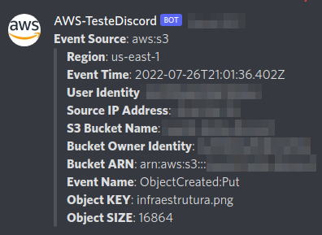

# Lambda para Envio de Notificações AWS SNS para Discord

... em construção... =)

Essa implementação foi uma melhoria da Lambda disponibilizada no Artigo do Daniel da Costa em 2020 para atender minha necessidade.

- [Discord notification using CloudWatch Alarms, SNS and AWS Lambda](https://towardsdatascience.com/discord-notification-using-cloudwatch-alarms-sns-and-aws-lambda-71393861699f)


Podemos no SNS, apontar criar uma nova **subscription** HTTPS e apontar o URL do Webhook para Envio de notificações.

A Proposta para a Lambda é poder customizar e encaminhar isso para o Webhook do Discord, podendo tratar as notificações previamente, criar um template de notificação customizado caso não deseje enviar um JSON limpo, enfim, existem infinitas possibilidades.

O código é simples, de forma geral vamos realizar o "parse" de algumas notificações para uma string/texto para esse envio, podendo enviar uma notificação mais simples/limpa (shortMessage) se for definida no ENV com a Flag para tal.

Em demais casos, vamos enviar somente o JSON indentado.

A Lambda vai retornar os logs em sua execução com as informações facilitando assim pegar esses logs aí no CloudWatchLogs para debuggar se preciso!


**Atualmente validado e testado o PARSE de DICT/JSON para STRING/TEXT para os serviços:**

- AWS/EC2; CWAgent;
- AWS/RDS;
- AWS/Lambda;
- AWS/SQS;
- AWS/S3 - Event notifications;

> Para demais Notificações como pontuado acima, ele vai retornar/enviar um **JSON indentado** somente.


# Para configurar a Lambda, informar as especificações do Runtime e ENVs:

## Runtime Settings

- NomeScript: lambda.py

- Runtime: Python 3.7

- Handler: lambda.handler


## Environments (ENVS)

- SHORT_MSG; True or False (Flag para notificações encurtadas para alguns Serviços)

- WEBHOOK_URL; URL do Webhook do Discord

- USERNAME_SENDER; Nome do Usuário/Remetente exibido no envio das Mensagens

- USERNAME_AVATAR_URL; Avatar do Usuário (URL para PNG/JPG) exibido no envio das Mensagens


> Sugestão para o AVATAR: https://a0.awsstatic.com/libra-css/images/logos/aws_logo_smile_1200x630.png

## Triggers:

Especificar os tópicos SNS que irão triggar a função Lambda!

&nbsp;

# Monitorando execuções da Lambda no CloudWatch Logs Insights:


Para filtar melhor nos logs do `CloudWatch Logs Insights` e acompanhar os fluxos para debuggar:

```
fields @timestamp, @message
| filter @message not like "START RequestId" and @message not like 'END RequestId' and @message not like 'REPORT RequestId'
| sort @timestamp asc
| limit 2000
```

&nbsp;

# Screenshots





